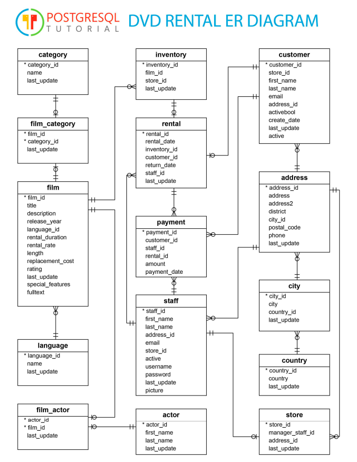

# DVD Rental Database SQL Analysis

## Overview
This repository contains a collection of SQL queries for analyzing the DVD Rental sample database. The queries demonstrate various SQL techniques and provide valuable business insights for a DVD rental store operation.

## Database Schema
The database follows a star schema design centered around the rental process of a DVD store. The ER diagram shows the following key entities:

### Core Tables:
- **film**: Contains movie information (title, description, release year, rental rates, etc.)
- **inventory**: Tracks specific copies of films available for rental
- **customer**: Stores customer information
- **rental**: Records rental transactions
- **payment**: Tracks payment information for rentals

### Supporting Tables:
- **category**: Film categories (Action, Comedy, etc.)
- **film_category**: Maps films to categories (many-to-many)
- **language**: Available film languages
- **actor**: Stores actor information
- **film_actor**: Maps films to actors (many-to-many)

### Location Tables:
- **store**: Store locations
- **address**: Physical addresses
- **city**: City information
- **country**: Country information

### Staff Information:
- **staff**: Employee information

## Queries Included

### Part 1: Data Retrieval
1. **Animation Movies Analysis**: Find all animation movies released between 2017-2019 with rates > 1
2. **Store Revenue**: Calculate revenue earned by each rental store after March 2017
3. **Top Actors**: Identify top 5 actors by number of movies they appeared in (released after 2015)
4. **Category Analysis by Year**: Count Drama, Travel, and Documentary movies per year

### Part 2: Business Problems
1. **Top Performing Employees**: Identify three employees who generated the most revenue in 2017
2. **Popular Movies Analysis**: Find the 5 most frequently rented movies with expected audience age information

### Part 3: Actor Inactivity Analysis
- **Approach 1**: Calculate gaps between an actor's latest film and current year
- **Approach 2**: Analyze gaps between sequential films for each actor

## Features
- Multiple solution approaches for each problem
- Comprehensive commenting explaining the logic
- Use of CTEs (Common Table Expressions) for improved readability
- CASE statements for transforming coded values into business-friendly descriptions
- Proper handling of NULL values
- Query optimization techniques

## Usage
These queries are designed to work with the PostgreSQL DVD Rental sample database. To use:

1. Import the DVD Rental database into your PostgreSQL instance
2. Run the queries in your preferred SQL client
3. Review the results for business insights

## Notes
- The queries assume PostgreSQL syntax
- Some queries provide multiple solution approaches to demonstrate different SQL techniques
- The ER diagram provides a visual representation of the database tables and their relationships